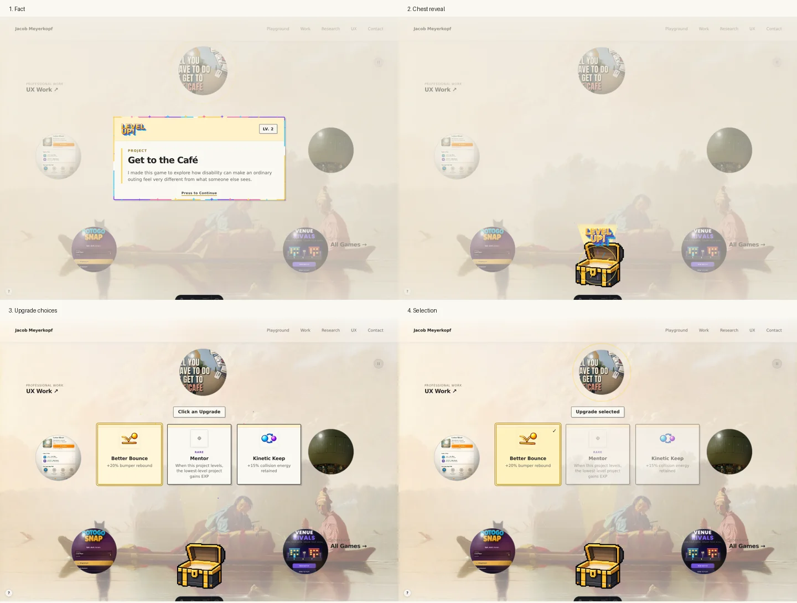
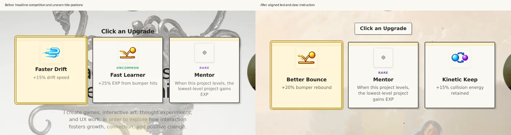
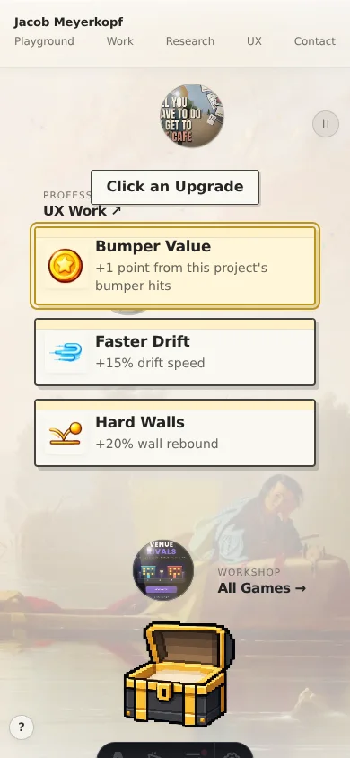

# Level-up presentation review

## Latest correction

The fact window no longer shows perimeter sparkles. Slow rotating border colors remain, along with the chest convergence and particles. The upgrade group is centered horizontally and vertically on regular screens. Its wrapper allows reveal motion to extend without making a scrolling container. Short-screen layouts remain positioned above the chest. Prior screenshots below show the previous presentation and do not represent this correction.

## Confirmed current decisions

Ivory/charcoal/yellow app windows; colorful arcade emblem; fact first; Press to Continue above the bottom border; 18-second border color rotation; multicolor sparkles converge into a bottom-center chest; chest opens with fanfare; three compact, independently styled opaque upgrade windows outside a shared panel; no pale group backdrop; Click an Upgrade; choose exactly one upgrade and resume. Existing project facts and upgrade effects remain unchanged.

## Rejected or superseded

Generic purple panels, wallpaper-themed medieval windows, the chest button inside the fact screen, upgrades enclosed in a shared window, translucent individual card backgrounds, and a pale backing over the full choices screen. None are reintroduced.

## Findings and fixes

1. Fact: healthy. Footer has room above the border. The window fades for 220ms while existing perimeter sparkles converge, replacing the abrupt removal. Decorative effects remain off under reduced motion.
2. Chest reveal: healthy. Persistent chest coordinates avoid a fade-to-empty frame when the choices replace the reveal. The existing fanfare is retained. Light is softer than the particles and options.
3. Choices: healthy. Shared typography, opacity, border, and spacing tokens follow the app. Rarity slots align desktop titles and effects; common slots collapse on mobile. Rarity labels use darker colors. Portfolio headline hides for the reward so it does not compete. Click an Upgrade has its own small opaque label without restoring a shared backdrop. Cards cannot accept selection until the 900ms travel/stagger has finished. Short-screen layout keeps options above the chest.
4. Selection and return: healthy. Selected upgrade gets a visible checkmark and Upgrade selected heading, plus a live announcement. Exactly one choice applies. The confirmation holds 520ms, then the overlay fades 220ms before gameplay resumes. Keyboard focus returns to the prior control or project tile. Exit and reveal callbacks check the current event and overlay.

## Browser evidence

New captures in this review, using authorized headless Chromium: desktop 1440 × 1024, mobile 390 × 844, landscape 844 × 390. Mobile choice group x30, y181, width330, height347. Landscape x42, y12, width760, height240. No page script errors.

Tests: fact/open/three choices/single selection/resume; reduced-motion sequence; keyboard Enter and Tab wrapping; synthetic click while revealing rejected; repeated selection applies one upgrade; hiding Playground and interrupting reveal does not resurrect an overlay. Production Astro build and syntax/whitespace checks passed. Test-only queue hooks were injected by the browser harness, not added to the production script.

## Design grounding and limits

Game Accessibility Guidelines advise clear language, clear interactive controls, and motion alternatives. Those support the clarity and input checks here, but they do not prescribe a universal visual style or certify this implementation. Source references:
- https://gameaccessibilityguidelines.com/use-simple-clear-language/
- https://gameaccessibilityguidelines.com/give-a-clear-indication-that-interactive-elements-are-interactive/
- https://gameaccessibilityguidelines.com/provide-an-option-to-turn-off-hide-background-movement/

Unresolved: full assistive-technology testing and device performance profiling are outside these browser checks. Some mechanics, such as Mentor, still use the existing neutral fallback icon. A replacement illustration needs a confirmed mapping and is not invented in this pass. Random painting and rolled options differ between before/after captures; layout and typography are the comparison focus. No claim of universal professional/game-design standards compliance.

Final result: presentation and tested flow checks passed.
